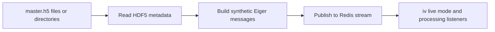

# Quick Start

- [Back to launcher overview](index.qmd)
- [See screenshot and diagram ideas](screenshots.qmd#diagram-ideas)
- Use `qp2/bin/mock_collect` for the GUI-driven simulator.
- Use `qp2/bin/mock_streamer` for the CLI-driven simulator.
- Provide one or more `*_master.h5` files or directories containing them.
- Stream to Redis `eiger` by default, or change host, port, and stream name.
- Use `--mode`, `--artificial-lag`, and `--file-arrival-delay` when you want to simulate specific collection or infrastructure behavior.

# Overview

The collection simulator replays existing HDF5 datasets as synthetic Eiger-style Redis stream events.

Main entry points:

- `qp2/bin/mock_collect`: GUI launcher for the mock streamer
- `qp2/bin/mock_streamer`: CLI launcher for the mock streamer service

Core implementation:

- `qp2/simulated_collection/mock_redis_streamer.py`
- `qp2/simulated_collection/mock_streamer_gui.py`

Use this workflow when:

- you want to test live-mode behavior in `iv`
- you want to exercise Redis-driven processing without a real detector
- you want repeatable playback of existing `*_master.h5` collections
- you want to simulate lag, looping, or delayed file visibility

# What It Simulates

This is a Redis stream simulator, not a detector hardware emulator.

What it does:

- reads one or more real HDF5 master files
- derives metadata such as run prefix, frame count, and collect mode
- emits synthetic Eiger-style messages to Redis
- paces frame delivery according to the requested playback rate

Main event types emitted:

- `dheader-1.0`
- `dimage-1.0`
- `dseries_end-1.0`

Default stream name:

- `eiger`

# GUI Workflow: `mock_collect`

`qp2/bin/mock_collect` launches the GUI titled `QP2 Mock Redis Streamer`.

Main GUI sections:

- `Configuration`
  - Redis host
  - Redis port
  - stream name
  - playback rate
  - collect mode override
  - artificial lag
  - lag interval
  - file arrival delay
  - loop and reset toggles
- `Master Files / Directories`
  - add files
  - add directories
  - remove selected
  - clear all
- controls
  - `Start Streaming`
  - `Stop`
- `Log Output`

Typical steps:

1. Open `qp2/bin/mock_collect`.
2. Configure Redis host, port, and stream.
3. Add one or more master files or directories.
4. Optionally set mode override, lag, or delayed file arrival.
5. Click `Start Streaming`.
6. Watch the log output.
7. Click `Stop` when done.

Important GUI behavior:

- the GUI spawns the Python streamer as a subprocess
- it always passes `--keep-data` and manages cleanup itself
- when stopped, it can prompt you to delete temporary staged files under `/tmp/mock_streaming`

# CLI Workflow: `mock_streamer`

`qp2/bin/mock_streamer` is the lower-dependency and more scriptable path.

Required positional input:

- `paths` one or more master files or directories

Common options:

- `--rate` playback rate in Hz
- `--loop`
- `--reset`
- `--stream`
- `--host`
- `--port`
- `--mode`
- `--artificial-lag`
- `--lag-frames`
- `--file-arrival-delay`
- `--keep-data`

Example: stream one file

```bash
qp2/bin/mock_streamer /data/test_run_master.h5 --host 127.0.0.1 --stream eiger --rate 100
```

Example: stream a directory recursively by directory scan

```bash
qp2/bin/mock_streamer /data/test_collection --rate 50 --mode RASTER --loop
```

Example: simulate lag and delayed file appearance

```bash
qp2/bin/mock_streamer /data/test_collection --artificial-lag 2 --lag-frames 100 --file-arrival-delay 5
```

# Collection-Mode Behavior

The simulator can override `collect_mode` with `--mode`.

Common values exposed in UI or help:

- `STANDARD`
- `VECTOR`
- `RASTER`
- `SITE`

Values also used in practice elsewhere in the repo include:

- `SINGLE`
- `STRATEGY`

Why this matters:

- downstream QP2 processing logic branches on collection mode
- a different mode changes which pipelines or live behaviors are triggered

## Example: simulate a raster scan

```bash
qp2/bin/mock_streamer /data/test_raster --mode RASTER --rate 20 --loop
```

Use this when:

- you want to exercise raster-oriented live behavior or raster-triggered downstream processing

## Example: simulate a site-style or standard collection

```bash
qp2/bin/mock_streamer /data/test_site --mode SITE --rate 100
```

```bash
qp2/bin/mock_streamer /data/test_standard --mode STANDARD --rate 100
```

Use these when:

- you want to mimic common rotation-style or site collection modes

## Example: simulate a strategy collection

```bash
qp2/bin/mock_streamer /data/test_strategy --mode STRATEGY --rate 10
```

Use this when:

- you want strategy-style downstream behavior from replayed HDF5 data

# File and Run Grouping Behavior

The simulator treats all provided master files as one run context and precomputes total frame counts before streaming.

What to expect:

- directories are scanned for `*_master.h5`
- invalid input paths are ignored until final validation
- if no valid master files are found, the tool exits with an error
- run prefix and run grouping are derived heuristically from filenames

# Lag and Delayed File Visibility

## Artificial lag

Use this when:

- you want to simulate periodic network or processing stalls

Controls:

- `--artificial-lag`
- `--lag-frames`

## File arrival delay

Use this when:

- you want to simulate the delay between Redis metadata arrival and data-file visibility on storage

Control:

- `--file-arrival-delay`

Behavior:

- files are staged under `/tmp/mock_streaming/<series_id>`
- data files appear later to mimic NFS or storage lag

# Reset and Cleanup Behavior

## `--reset`

Use this carefully.

What it does:

- deletes the named Redis stream before starting

Practical warning:

- this is destructive for the chosen test stream and should not be used carelessly on shared environments

## Cleanup

CLI behavior:

- temporary staged mock data is normally deleted on exit unless `--keep-data` is set
- after a non-looping run completes, the process stays alive until interrupted so cleanup can still happen later

GUI behavior:

- always preserves staged data during the child run
- asks whether to delete `/tmp/mock_streaming` when stopped

# Diagram



# Caveats

- This simulates Redis detector messages, not real detector hardware.
- Input must be valid `*_master.h5` files or directories containing them.
- Redis must already be available and reachable.
- `--reset` deletes the selected stream key before starting.
- Mode names used in practice are broader than the short examples shown in CLI help or GUI defaults.
- The name `mock_collect` is slightly misleading because it launches the GUI for the mock streamer, not a separate collection engine.

# Related Pages

- [Launcher overview](index.qmd)
- [Image Viewer (`iv`)](iv.qmd)
- [Data Viewer (`dv`)](dv.qmd)
- [HDF5 Combiner](hdf5combiner.qmd)
