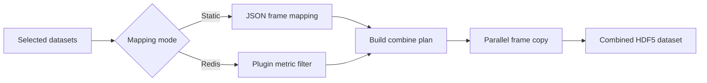

# Quick Start

- [Back to launcher overview](index.qmd)
- [See screenshot and diagram ideas](screenshots.qmd#diagram-ideas)
- Use the HDF5 combiner when you want to build one synthetic HDF5 dataset from selected frames across one or more master files.
- In `iv`, open the dataset tree context menu and choose `Serial Processing -> Hits Combiner (N Selected)`.
- Choose either a static frame mapping or a Redis-driven selection rule, then set output prefix and output directory.
- Run locally for fast tests, or submit to Slurm for larger jobs.

# Overview

`hdf5combiner` is the workflow for combining selected frames from multiple HDF5 datasets into one output HDF5 dataset.

Main script:

- `qp2/xio/hdf5_combiner.py`

How users usually reach it:

- from `iv` through `Serial Processing -> Hits Combiner (N Selected)`

Use this workflow when:

- you want to collect hits or selected frames from many datasets into one combined dataset
- you want to filter frames by a Redis metric such as Dozor or spotfinding score
- you want a single combined HDF5 output for downstream review or processing

# Two Input Modes

## Static mapping mode

Use this when:

- you already know exactly which frames to pull from which master files

CLI input:

- `--mapping`

Expected format:

- JSON string or path to a JSON file
- mapping form: `{master_path: [frames]}`

Example:

```bash
python qp2/xio/hdf5_combiner.py --mapping '{"/data/run1_master.h5": [1, 5, 10], "/data/run2_master.h5": [3, 7]}' --prefix combined_hits --outdir /tmp/combined
```

## Redis scan mode

Use this when:

- you want QP2 to discover frames automatically from analysis results stored in Redis

CLI inputs:

- `--plugin`
- `--metric`
- `--condition`
- optional `--redis_host`
- optional `--files`

Example:

```bash
python qp2/xio/hdf5_combiner.py --plugin dozor --metric "Main Score" --condition "> 10" --files /data/run1_master.h5 /data/run2_master.h5 --prefix combined_hits --outdir /tmp/combined
```

What it does:

- scans Redis hashes for the selected plugin
- reads per-frame metrics
- keeps only frames that satisfy the condition
- builds the combine mapping automatically

# Common Parameters

Required:

- `--prefix`

Common optional parameters:

- `--outdir` default `.`
- `--n` maximum images per output data file, default `1000`
- `--nproc` number of local worker processes, default `8`

Slurm submission parameters:

- `--submit`
- `--time`
- `--mem`

# Main Workflow in `iv`

The normal user-facing path is through the image viewer.

Steps:

1. Open `iv`.
2. Select one or more datasets in the dataset tree.
3. Right-click and open `Serial Processing`.
4. Choose `Hits Combiner (N Selected)`.
5. In the dialog, choose either:
   - Redis-driven filtering
   - manual/static mapping
6. Set output prefix, output directory, image-per-file limit, and process count.
7. Choose local background execution or Slurm submission.
8. Start the job.

What to expect:

- QP2 builds the command line for `qp2/xio/hdf5_combiner.py`
- selected dataset paths are passed through when using Redis mode
- logs are written under the output directory

# Output Behavior

The combiner creates one new combined HDF5 dataset.

Success output:

- path to the combined master file
- total number of frames combined

Implementation behavior:

- frame copying is parallelized with worker processes
- output data is written into a standard `/entry/data` HDF5 structure
- Bitshuffle compression is used when available

Practical meaning:

- the output is meant to behave like a normal HDF5 dataset, but made from selected frames across multiple source datasets

# Local vs Slurm Execution

## Local background mode

Use this when:

- you want a quick run from the workstation
- the selected frame count is modest

Behavior:

- QP2 launches the combiner as a detached background process
- output is logged to `combiner_<prefix>.log`

## Slurm mode

Use this when:

- the combine job is larger
- you want the work to run on the cluster

Behavior:

- QP2 checks for `sbatch`
- the combiner command is rebuilt and submitted to Slurm
- cluster-safe Python and project-root environment variables are used when available

# Diagram



# Caveats

- There is no dedicated `qp2/bin/hdf5combiner` wrapper; the workflow is centered on `qp2/xio/hdf5_combiner.py` and the `iv` dialog path.
- Redis mode requires both available Redis data and a valid plugin/metric pair.
- Slurm mode requires `sbatch` and a valid cluster environment.
- A bad mapping JSON or invalid Redis query exits early.
- Large combine jobs can be I/O heavy, so local runs may be slower than expected on network filesystems.

# Related Pages

- [Launcher overview](index.qmd)
- [Image Viewer (`iv`)](iv.qmd)
- [Strategy](strategy.qmd)
- [H5 to CBF](h5_to_cbf.qmd)
