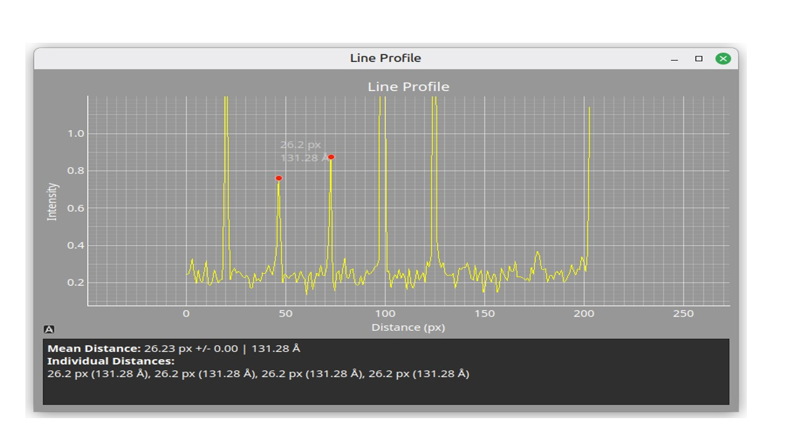
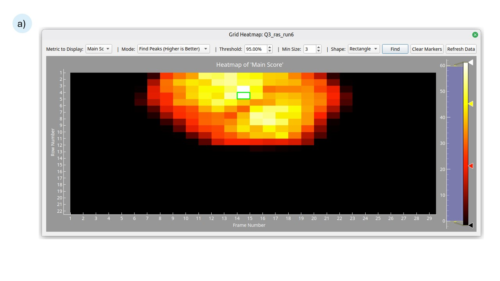
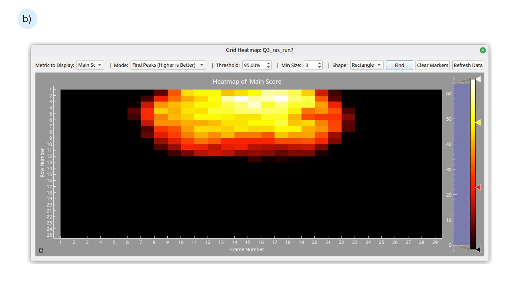
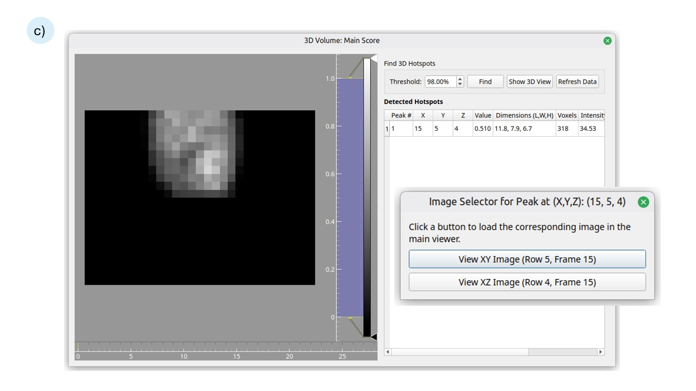
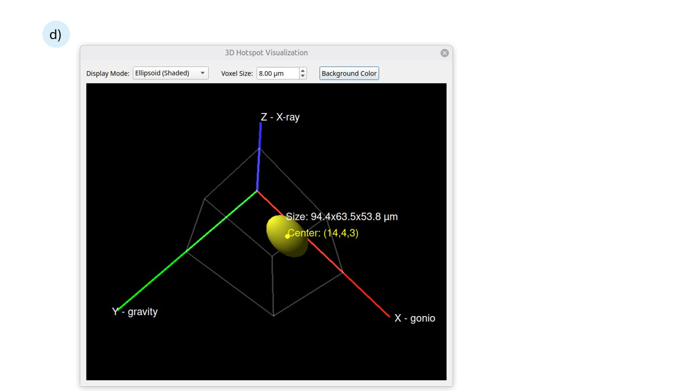
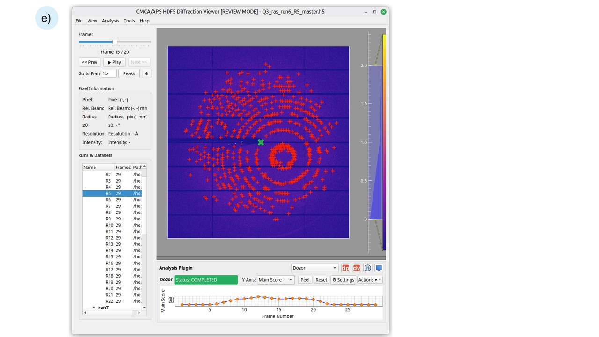
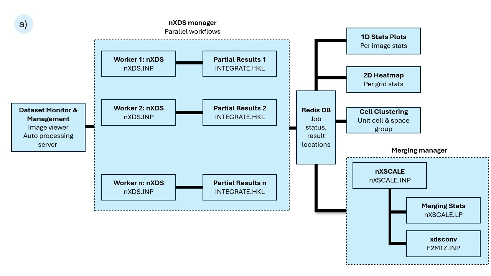
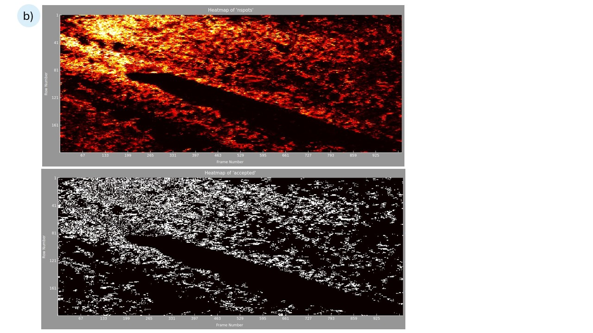

# Quick Start

- [Back to launcher overview](index.qmd)
- [See screenshot and diagram ideas](screenshots.qmd#iv)
- Open the viewer with `qp2/bin/iv`.
- Load data from `File -> Open Master File(s)...`, `File -> Open Directories...`, or `File -> Load from List File...`.
- Reprocess or launch new jobs from the dataset tree: select a sample, run, or dataset -> right-click -> `Standard Processing` or `Serial Processing`.
- Make a heat map from one raster run: dataset tree -> right-click -> `Show 2D Grid Heatmap...`.
- Make a 3D volume from two orthogonal raster runs: dataset tree -> right-click -> `Construct 3D Volume...`.
- Switch analysis modes from the plugin selector in the lower analysis pane.
- Use `Processing Job Status` from the dataset context menu or top controls to check job state and rerun failures.

# Overview

`iv` is the main diffraction image viewer in QP2. It combines frame-by-frame inspection, dataset browsing, live-mode monitoring, plugin-based analysis, and direct processing launch.

The launcher script is `qp2/bin/iv`. It prepares the environment and then starts `qp2.image_viewer.ui.main`. If the current user is not in one of the authorized live-mode groups, the launcher automatically adds `--nolive`, so the viewer opens in review mode.

{width=90% fig-align="center"}

# Live Mode vs Review Mode

## Live mode

Use live mode when:

- you want the viewer to follow detector Redis updates
- you want newly arriving data to appear automatically
- you want plugins to respond while data is still being collected

What to expect:

- the window title includes `[LIVE MODE]`
- `File -> Follow detector redis` changes to `Unfollow detector redis` while following
- some plugins can auto-submit or auto-refresh as a dataset finishes collecting

## Review mode

Use review mode when:

- you are opening existing files from disk
- you are not authorized for live mode
- Redis is unavailable or you do not want live following

What to expect:

- the window title includes `[REVIEW MODE]`
- you load data manually from files, directories, lists, or recent records
- processing is usually launched manually from the dataset tree or plugin area

# Main Window Layout

The main visible areas are:

- `Viewer Controls` dock on the left
  - frame slider
  - frame label
  - previous, next, and play buttons
  - frame input
  - quick peak-finding controls
  - pixel information readout
- `Runs & Datasets` dock on the left
  - tree of samples, runs, and datasets
  - right-click context menu for processing, visualization, and utilities
- image display in the center
  - diffraction image
  - overlays for peaks, rings, reflections, masks, and measurements
- analysis pane at the bottom
  - plugin selector
  - plugin-specific controls and plots
  - buttons for data processing, data viewer launch, and status access
- optional extra windows or docks
  - Python Console
  - AI Assistant
  - detached plugin plot windows via `Peel`

# Menu Reference

This section follows the visible menu structure exactly.

## File

### `File -> Open Master File(s)...`

Open one or more HDF5 master files directly.

### `File -> Open Directories...`

Search selected directories for master files and load them into the dataset tree.

### `File -> Load from List File...`

Load dataset paths from a text file, one path per line.

### `File -> Load Latest via Redis`

Query Redis for the latest available dataset and open it.

### `File -> Recent Datasets...`

Show recent datasets discovered via Redis and open one from the list.

### `File -> Follow detector redis` / `File -> Unfollow detector redis`

Start or stop following detector Redis updates.

Typical use:

- use this in live monitoring sessions
- stop following when you want the view to stay on the current dataset

Notes:

- this action is disabled when Redis is unavailable
- the label changes depending on current live-follow state

### `File -> Show HDF5 Metadata...`

Display metadata from the current HDF5 master file.

Typical use:

- inspect beamline metadata
- export geometry-related information
- review detector or acquisition details

### `File -> Settings...`

Open the application settings dialog.

### `File -> Exit`

Close the viewer.

## View

### `View -> Lock Contrast/Colormap`

Prevent contrast or colormap changes when switching datasets or frames.

### `View -> Auto-Contrast on Zoom/Pan/Frame change`

Recompute contrast automatically based on the current view or current frame.

### `View -> Focus on 10A-3.5A`

Jump the display toward the mid-to-high resolution region.

Practical note:

- this is a quick display-focus action, not a processing step

### `View -> Toggle Resolution Rings`

Show or hide resolution rings on the image.

### `View -> Toggle Mask Overlay`

Show or hide the detector mask overlay.

### `View -> Show Image Stats Overlay`

Show or hide image statistics over the display.

### `View -> Clear All Visuals`

Remove displayed peaks, spots, rings, and other temporary overlays.

## Analysis

### `Analysis -> Auto Find Peaks on Change`

Automatically run peak finding when the displayed frame changes.

Behavior:

- useful for browsing frames and seeing likely hits quickly
- can slow or interrupt smooth playback because analysis runs on each frame change

### `Analysis -> Apply Image Filter`

Apply an image filter to the displayed image.

### `Analysis -> Sum/Slab Frames`

Sum the current frame with the next frames based on playback or summation settings.

Typical use:

- inspect weak signal by combining neighboring frames

### `Analysis -> Radial Sum Analysis...`

Run radial intensity analysis on the current image.

### `Analysis -> Analyze Ice Rings...`

Check the image for common ice ring signatures.

### `Analysis -> Index/Strategy -> Strategy (XDS)...`

Launch an XDS-based strategy workflow.

### `Analysis -> Index/Strategy -> Strategy (MOSFLM)...`

Launch a MOSFLM-based strategy workflow.

### `Analysis -> Index/Strategy -> Strategy (Both)...`

Launch both strategy variants and compare outputs.

### `Analysis -> Index/Strategy -> Index (CrystFEL)...`

Run a CrystFEL indexing-oriented action from the current dataset context.

## Tools

### `Tools -> Measure Distance`

Enable measurement mode for selecting two points and measuring pixel and Angstrom distance.

### `Tools -> Calculate Line Profile`

Select a line on the image and calculate intensity along that line.

### `Tools -> Show 2D Profile`

Use the 2D profile tool, typically with a drag action, to inspect local signal structure.

### `Tools -> Beam Center Calibration (Rings)...`

Run ring-based beam-center calibration.

### `Tools -> Update Master File (to correct geometry)`

Estimate a corrected beam center and write geometry updates back to the master-file-related workflow.

Practical caution:

- this is more invasive than a pure display tool because it is intended to update geometry information

### `Tools -> Detector Masking -> Find Stuck Hot Pixels...`

Analyze frames to locate persistently hot or noisy detector pixels.

### `Tools -> Detector Masking -> Update Detector Mask`

Recompute the detector mask for the current dataset.

### `Tools -> Python Console`

Show or hide the Python Console dock.

## Help

### `Help -> AI Assistant`

Open or close the AI Assistant window.

Note:

- this is a separate window, not a dock

### `Help -> About...`

Show application information.

# Dataset Tree and Context Menu

The dataset tree is the most important operational surface in `iv`.

Tree structure:

- sample
- run
- dataset

Selection behavior:

- selecting a sample includes all runs and datasets under it
- selecting a run includes all datasets under that run
- selecting datasets uses only those datasets
- if nothing is selected, many operations fall back to all loaded datasets

## Top-level context actions

### `Display Processing Job Status...`

Show a job-status dialog for the selected datasets.

Use it for:

- reviewing success, failure, or running state
- filtering by plugin or pipeline
- resubmitting failed jobs

### `Show 2D Grid Heatmap...`

Available when one selected run looks like a raster run.

Use it for:

- reviewing raster hit quality or another active metric over a 2D grid

### `Construct 3D Volume...`

Available when two selected runs look like orthogonal raster scans.

Use it for:

- building a 3D volume-style reconstruction from compatible raster pairs

## `Standard Processing`

### `Standard Processing -> Run XDS...`

Launch XDS processing for one dataset, or one job per dataset when multiple datasets are selected.

### `Standard Processing -> Run autoPROC...`

Launch autoPROC processing, with merge behavior when multiple compatible datasets are selected.

### `Standard Processing -> Run xia2...`

Launch xia2 processing, with merge behavior when multiple compatible datasets are selected.

### `Standard Processing -> Run Strategy -> on N Dataset(s) (XDS)`

Run XDS-based strategy calculations on the selected datasets.

### `Standard Processing -> Run Strategy -> on N Dataset(s) (MOSFLM)`

Run MOSFLM-based strategy calculations on the selected datasets.

### `Standard Processing -> Run Strategy -> on N Dataset(s) (Both)`

Run both strategy methods on the selected datasets.

### `Standard Processing -> Process N Dataset(s)...`

Open the general processing dialog from inside `iv` for the selected datasets.

This is the main generic path when you want full manual control instead of a one-click pipeline launch.

## `Serial Processing`

### `Serial Processing -> Run xia2.ssx...`

Launch xia2 SSX processing for a single selected dataset.

### `Serial Processing -> Run xia2.ssx (N Datasets)... -> Distributed (Cluster - Recommended)`

Use the distributed xia2 SSX route for a cluster-oriented multi-dataset serial workflow.

### `Serial Processing -> Run xia2.ssx (N Datasets)... -> Merge (Standard)`

Use the standard merge-style xia2 SSX workflow.

### `Serial Processing -> Run xia2.ssx (N Datasets)... -> Batch Mode (N Datasets)...`

Run each selected dataset as a separate xia2 SSX batch job.

### `Serial Processing -> Run xia2.ssx (N Datasets)... -> Merge Batch Results (N Datasets)...`

Merge previously produced xia2 SSX batch results.

### `Serial Processing -> Run CrystFEL Batch (N Datasets)... -> Process Selected Datasets`

Start a CrystFEL batch job for the selected datasets.

### `Serial Processing -> Run CrystFEL Batch (N Datasets)... -> Merge Batch Results...`

Merge results from a previous CrystFEL batch run.

### `Serial Processing -> Group Rerun (N Datasets)`

Clear previous stored analysis state and resubmit jobs for a group of datasets.

Typical targets:

- `nXDS`
- `Dozor`
- the currently active plugin when supported

Caution:

- this is destructive for the stored result state and is meant for deliberate reruns

### `Serial Processing -> nXDS Analysis`

Result-driven follow-up actions such as:

- `Cluster Unit Cells...`
- `Crystal Orientation Analysis...`
- `Merge/Solve Pipeline ...`

These are mainly useful after nXDS results already exist.

### `Serial Processing -> CrystFEL Analysis`

Result-driven CrystFEL follow-up actions such as reflection merging.

### `Serial Processing -> DIALS Analysis`

Currently limited in the visible UI and mainly acts as a placeholder for future clustering-style actions.

### `Serial Processing -> Hits Combiner (N Selected)`

Open the dataset combination workflow for hit-based or selected result aggregation.

## `Utilities`

### `Utilities -> File System`

Common actions include:

- copying selected paths to the clipboard
- exporting selected paths to a file
- rescanning selected files

### `Utilities -> Management`

Common actions include:

- removing selected entries from the current viewer history
- selecting all or clearing selection
- filtering the dataset tree by name
- clearing the filter

# How To Process Data in `iv`

## Reprocess or process one dataset

Data processing and reprocessing can both happen directly inside `iv`.

1. Load the dataset into the tree.
2. Select the dataset row.
3. Right-click.
4. Choose one of:
   - `Standard Processing -> Run XDS...`
   - `Standard Processing -> Run autoPROC...`
   - `Standard Processing -> Run xia2...`
   - `Standard Processing -> Process 1 Dataset...`
   - `Serial Processing -> Run xia2.ssx...`
5. Review the settings dialog if one appears.
6. Submit the job.

When to prefer the generic process dialog:

- you want to adjust more parameters before submission
- you want explicit control over output directories, merge mode, or advanced options

Plugin-driven processing note:

- if a processing plugin is selected in live mode and QP2 does not detect a previous run for that dataset, the plugin can auto-run without you manually launching the job from the context menu
- this is most relevant for plugins such as XDS, nXDS, CrystFEL, autoPROC, xia2, and xia2 SSX

## Process several datasets

1. Select multiple dataset rows, or select a run or sample to include many datasets at once.
2. Right-click the selection.
3. Choose a standard or serial processing path.
4. For merge-capable workflows, decide whether you want one merged job or one job per dataset.
5. Submit the job.

Typical use:

- merged rotation processing with `xia2` or `autoPROC`
- one-job-per-dataset XDS processing plus follow-up merge
- batch serial processing with `xia2.ssx` or `CrystFEL`

## Rerun failed jobs

1. Open the dataset context menu.
2. Choose `Display Processing Job Status...`.
3. Filter to the relevant plugin if needed.
4. Review failed jobs.
5. Use the resubmit workflow from the status dialog.

## Run strategy calculations

1. Select the dataset or datasets.
2. Right-click.
3. Open `Standard Processing -> Run Strategy`.
4. Choose `XDS`, `MOSFLM`, or `Both`.

## Run serial processing

1. Select one or more serial datasets.
2. Right-click.
3. Open `Serial Processing`.
4. Choose the serial engine or batch mode.
5. Submit.

## Analysis and processing figures

{width=85% fig-align="center"}

{width=85% fig-align="center"}

# Analysis Plugins

`iv` can switch between analysis plugins in the lower analysis pane.

Two practical questions matter most for users:

- what settings belong to the plugin itself, and what settings come from global `iv` settings
- what the plugin does automatically in live mode versus what stays manual in review mode

## Which plugin should I choose?

- Choose `Live Spot Finder` when you want the fastest frame-by-frame hit finding and immediate feedback while browsing.
- Choose `Dozor` when you want frame-quality scoring and a quick ranking of useful images.
- Choose `nXDS` when you want serial indexing review and frame-by-frame indexed versus unindexed behavior.
- Choose `Crystfel` when you are reviewing CrystFEL serial indexing results or CrystFEL batch processing.
- Choose `XDS`, `autoPROC`, or `xia2` when you are reviewing standard rotation-dataset processing.
- Choose `xia2 SSX` when you are reviewing serial or batch SSX results rather than single-frame live behavior.

## Plugin comparison

| Plugin | Best use | Inherits common `iv` processing settings? | Auto-runs in live mode? | Review-mode behavior |
|---|---|---|---|---|
| `Live Spot Finder` | Fast peak finding and hit review | No, mainly uses viewer frame-analysis settings | Yes, reacts naturally to arriving frames | Manual inspection and result display |
| `Dozor` | Frame-quality scoring and ranking | Partial, especially resolution fallback | Yes, can auto-process incoming segments | Refresh and manual rerun |
| `nXDS` | Serial indexing review | Yes | Yes, after dataset completion, especially when no previous run is detected | Refresh existing results or rerun with `Clear and Re-run` |
| `Crystfel` | CrystFEL serial review | Yes, for some shared fields | Yes, after dataset completion, especially when no previous run is detected | Result viewing or rerun with `Clear and Re-run` |
| `XDS` | Standard rotation processing review | Yes | Yes, after dataset completion, especially when no previous run is detected | Result viewing or rerun with `Clear and Re-run` |
| `autoPROC` | Standard processing reports and downstream maps | Yes | Yes, after dataset completion, especially when no previous run is detected | Result viewing or rerun with `Clear and Re-run` |
| `xia2` | Standard xia2 result review | Yes | Yes, after dataset completion, especially when no previous run is detected | Result viewing or rerun with `Clear and Re-run` |
| `xia2 SSX` | Serial SSX result review | Yes | Yes, after dataset completion, especially when no previous run is detected | Summary review or rerun with `Clear and Re-run` |

Available plugin names in the selector:

- `Live Spot Finder`
- `Dozor`
- `nXDS`
- `Crystfel`
- `XDS`
- `autoPROC`
- `xia2`
- `xia2 SSX`

A `DIALS SSX` manager exists in code, but it is not currently exposed in the main selector.

## Plugin settings and interaction with `iv` settings

Plugin settings are not isolated from the rest of `iv`. QP2 keeps them in the same shared settings store, but with plugin-specific names such as `xds_*`, `nxds_*`, `dozor_*`, `xia2_*`, `autoproc_*`, and `crystfel_*`.

What this means in practice:

- each processing plugin has its own settings dialog for plugin-specific options
- `iv -> File -> Settings...` also exposes global processing defaults shared across plugins
- if a plugin-specific field is left empty, many plugins fall back to the global common value
- if you intentionally override the common value inside the plugin dialog, the plugin uses its own value instead

Global `iv` settings that commonly affect plugins include:

- common space group
- common unit cell
- common model file
- common reference HKL
- common processing root
- common low and high resolution cutoffs
- common native or anomalous choice

Typical interaction pattern:

- set beamline-wide or experiment-wide defaults once in `iv` settings
- open a plugin settings dialog only when that plugin needs an override
- expect plugin-specific settings to win when they are explicitly set

Examples:

- XDS, nXDS, xia2, xia2 SSX, autoPROC, and CrystFEL can all inherit some settings from the common processing section
- Dozor can also pick up common resolution limits when its own limits are left at defaults
- live spot finding uses its own peak-finding parameters rather than the processing-job parameter set

## Common plugin behavior

Most plugins share these behaviors:

- they appear in the lower analysis pane
- they can update when the dataset changes
- they can emit status messages to the viewer status area
- plot-oriented plugins let you click a point and jump to the corresponding frame
- the `Peel` button detaches the plot into its own floating window
- the `Actions` menu usually includes refresh and rerun-style commands

Common user-visible controls in plugin panels:

- status label
- y-axis or metric selector for plot-based plugins
- `Peel` or `Dock`
- `Reset`
- `Actions`

## Live mode vs review mode behavior

This is the most important plugin behavior difference.

### In live mode

What usually happens automatically:

- `iv` can auto-start playback when frames are arriving
- per-frame or per-file plugins such as live spot finding and Dozor can auto-process available or incoming data segments
- per-dataset plugins such as XDS, nXDS, CrystFEL, autoPROC, xia2, and xia2 SSX can auto-run when the dataset-completion event is seen
- if the selected processing plugin does not detect a previous run for the dataset, it can auto-submit the first run for you in live mode
- most plugins continue auto-refreshing their plots or result displays on a timer

Practical meaning:

- live mode is the best choice when you want the selected plugin to react as data arrives
- some plugins begin useful work without you manually re-submitting the dataset once the right live events appear
- processing can start directly from the selected plugin, not only from the dataset-tree context menu

### In review mode

What changes:

- plugins can still load and display existing results
- plugins can still refresh plots and status displays
- plugins generally do not auto-submit new processing jobs for an already loaded, completed dataset
- reruns are expected to be manual

Practical meaning:

- review mode is for inspecting data and results you already have
- if you want to reprocess, use the plugin's rerun action or the dataset-tree processing actions
- the most direct plugin-driven reprocessing path is usually `Actions -> Clear and Re-run`

### Refresh vs rerun

These are different actions and users often confuse them.

`Refresh` means:

- re-read current results from Redis or files
- redraw the plot or update the displayed status
- do not submit a new processing job

`Clear and Re-run` means:

- clear stored plugin result state
- submit analysis or processing again
- use this when you really want a fresh rerun, not just a visual update
- in review mode, this is the main plugin action for triggering reprocessing from the analysis pane

## `Live Spot Finder`

Settings behavior:

- uses the viewer's peak-finding settings rather than the common processing-job parameter set
- responds to the current frame-analysis configuration in `iv`

Typical behavior:

- shows spot counts or live peak-finding output by frame
- uses the current frame-analysis settings from the viewer
- clicking points moves the image view to the corresponding frame and shows peaks
- in live mode it is one of the most responsive plugins because it works naturally with arriving frames
- in review mode it is still useful for manual inspection, but it does not have the same live-arrival behavior

Use it for:

- fast hit finding and frame-by-frame peak review

## `Dozor`

Settings behavior:

- has its own Dozor-specific settings dialog
- can inherit common resolution-cutoff values from `iv` settings when its own values are left at defaults

Typical behavior:

- shows Dozor-derived frame metrics
- batches incoming segments in live workflows
- clicking points can display Dozor spots on the image
- in live mode it can auto-process new incoming file segments
- in review mode it mainly refreshes and displays existing results unless you manually rerun

Use it for:

- ranking frames by diffraction quality
- reviewing dataset quality trends

## `nXDS`

Settings behavior:

- has its own nXDS settings dialog
- can inherit common space group, unit cell, model, reference HKL, and processing-root values from `iv` settings when plugin-specific overrides are not set

Typical behavior:

- plot-oriented indexed versus unindexed display
- clicking points selects the frame and overlays spots or indexed reflections
- shows indexing-related cell or lattice information when available
- in live mode it can auto-run when a dataset-completion event is seen
- in review mode it usually waits for manual rerun or existing result refresh

Use it for:

- serial indexing review
- checking which frames indexed successfully

## `Crystfel`

Settings behavior:

- has its own CrystFEL settings dialog with serial-processing and indexing controls
- can inherit model-file and processing-root values from the common `iv` settings when those plugin-specific values are not set

Typical behavior:

- plot-oriented indexed versus unindexed display
- clicking points shows spots and indexed reflection overlays when available
- exposes indexer and lattice information when results exist
- in live mode it can auto-run when the dataset completes and the live workflow is active
- in review mode it acts mainly as a result viewer unless you explicitly rerun

Use it for:

- CrystFEL result review after indexing or batch jobs

## `XDS`

Settings behavior:

- has its own XDS settings dialog
- can inherit common space group, unit cell, model file, reference HKL, resolution limits, and processing-root values from `iv` settings when plugin overrides are not set

Typical behavior:

- focused on per-frame and dataset statistics rather than spot overlays
- includes a `View Report` action when report files exist
- clicking points jumps to a frame and shows statistics
- in live mode it can auto-run once a dataset is recognized as complete
- in review mode it mainly refreshes and displays existing results until you rerun manually

Use it for:

- reviewing standard rotation processing output

## `autoPROC`

Settings behavior:

- has its own autoPROC settings dialog
- can inherit common space group, unit cell, model file, resolution limits, and processing-root values from `iv` settings when plugin overrides are left empty

Typical behavior:

- report-oriented, not plot-oriented
- hides the standard plot controls
- exposes report and summary actions when output files exist
- can offer a `Launch Coot` action when Dimple-style output is available
- in live mode it can auto-run after dataset completion
- in review mode it behaves mainly as a result-review plugin unless you trigger a rerun

Use it for:

- reviewing finished autoPROC results and downstream maps

## `xia2`

Settings behavior:

- has its own xia2 settings dialog
- can inherit common space group, unit cell, model file, resolution limits, and processing-root values from `iv` settings when plugin-specific overrides are not set

Typical behavior:

- report-oriented, not plot-oriented
- exposes HTML or text-summary output when available
- can offer `Launch Coot` when downstream map files exist
- in live mode it can auto-run after dataset completion
- in review mode it mainly displays prior results unless you rerun manually

Use it for:

- reviewing standard xia2 outputs

## `xia2 SSX`

Settings behavior:

- has its own xia2 SSX settings dialog
- can inherit common space group, unit cell, model file, reference HKL, resolution limits, native/anomalous choice, and processing-root values from `iv` settings when plugin overrides are not set

Typical behavior:

- report-oriented serial-processing summary plugin
- exposes HTML or text-summary review
- focuses on batch and serial results instead of plot-based frame inspection
- in live mode it can auto-run after dataset completion when the live workflow is active
- in review mode it is mostly a summary and rerun surface rather than an auto-submitting plugin

Use it for:

- checking results from xia2 SSX runs

# Heat Maps and 3D Volume Workflows

::: {.grid}

::: {.g-col-6}
{fig-align="center"}
:::

::: {.g-col-6}
{fig-align="center"}
:::

:::

::: {.grid}

::: {.g-col-6}
{fig-align="center"}
:::

::: {.g-col-6}
{fig-align="center"}
:::

:::

{width=85% fig-align="center"}

::: {.grid}

::: {.g-col-6}
{fig-align="center"}
:::

::: {.g-col-6}
{fig-align="center"}
:::

:::

## 2D heat map

Requirements:

- one selected run that QP2 recognizes as raster-like

Typical steps:

1. Select the raster run in the dataset tree.
2. Right-click.
3. Choose `Show 2D Grid Heatmap...`.
4. Review the generated map and, if needed, change the active plugin to alter the underlying metric.

## 3D volume

Requirements:

- exactly two selected runs
- runs should represent roughly orthogonal raster scans

Typical steps:

1. Select both raster runs.
2. Right-click.
3. Choose `Construct 3D Volume...`.
4. Inspect the generated volume display.

# Caveats

- `qp2/bin/iv` may force review mode by adding `--nolive` for users outside the authorized live-mode groups.
- Many features depend on Redis. If Redis is unavailable, recent-dataset browsing, job status, or follow mode may be limited or disabled.
- The dataset context menu is selection-sensitive; some actions only appear for one raster run or for two compatible raster runs.
- Group rerun clears prior stored result state before resubmitting jobs.
- Some pipelines skip unsuitable collection modes such as raster or strategy datasets for standard rotation processing.
- `DIALS SSX` exists in code but is not currently exposed as a normal plugin selector option.

# Related Pages

- [Launcher overview](index.qmd)
- [Data Viewer (`dv`)](dv.qmd)
- [Data Processing Launcher (`dp`)](dp.qmd)
- [Dose Planner](dose_planner.qmd)
