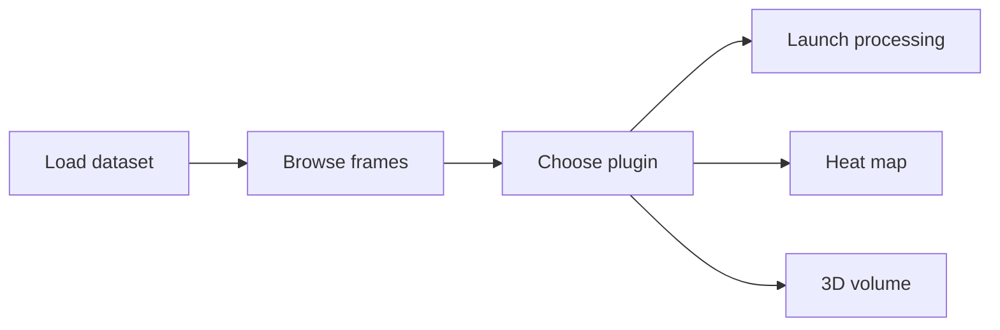
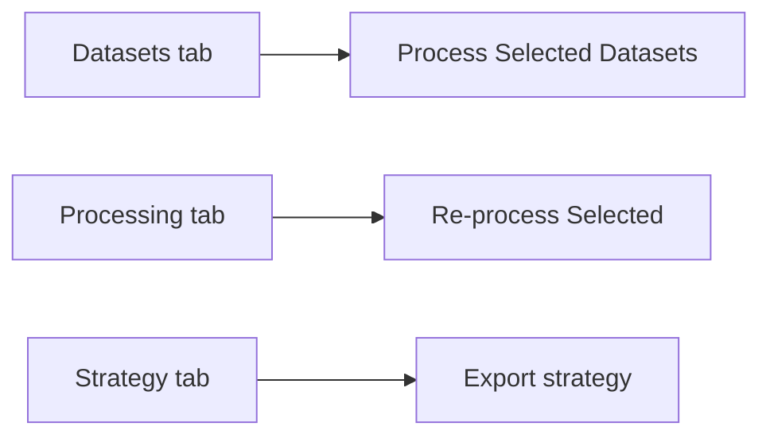
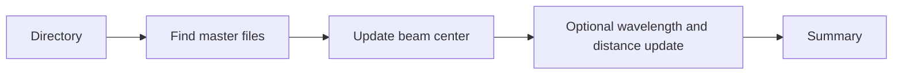
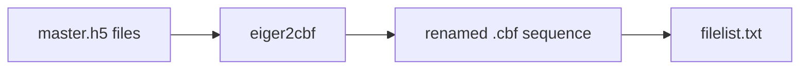
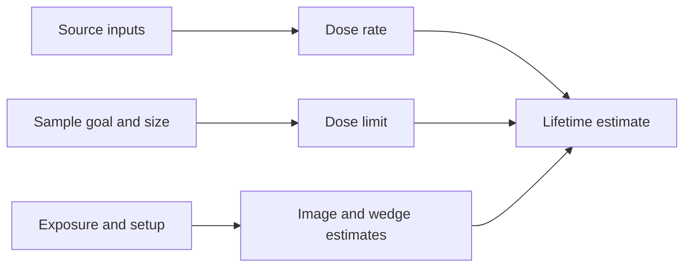
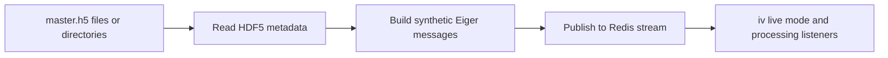

# Quick Start

- [Back to launcher overview](index.qmd)

# Overview

This page collects recommended screenshots and diagrams for the QP2 launcher docs. It is meant as a lightweight visual roadmap so screenshots can be added incrementally without blocking the main documentation.

# Screenshot Priorities

## High priority

### `iv`

Recommended captures:

- full main window with dataset tree, image display, and plugin pane visible
- dataset-tree context menu open on a raster run
- one analysis plugin pane such as `Dozor` or `Live Spot Finder`
- heat map view from `Show 2D Grid Heatmap...`
- 3D volume view from `Construct 3D Volume...`

Existing mapped paper figures:

- `qp2/paper/figures/Slide2-1.jpg` -> `iv` main window
- `qp2/paper/figures/Slide2-2.jpg` -> `iv` line profile
- `qp2/paper/figures/Slide2-3.jpg` -> `iv` XDS indexing
- `qp2/paper/figures/Slide3-1.jpg` -> `iv` 2D heat map (XY)
- `qp2/paper/figures/Slide3-2.jpg` -> `iv` 2D heat map (XZ)
- `qp2/paper/figures/Slide3-3.jpg` -> `iv` 3D volume
- `qp2/paper/figures/Slide3-4.jpg` -> `iv` 3D reconstruction
- `qp2/paper/figures/Slide3-5.jpg` -> `iv` diffraction image for a detected peak
- `qp2/paper/figures/Slide4-1.jpg` -> `iv` nXDS workflow
- `qp2/paper/figures/Slide4-2.jpg` -> `iv` nXDS heat map

Why it helps:

- `iv` has the richest UI surface and benefits most from visual orientation

### `dv`

Recommended captures:

- main window with `Datasets`, `Processing`, and `Strategy` tabs visible
- `Processing` tab context menu open on one or more selected rows
- `Datasets` tab context menu open for raw dataset submission

Existing mapped paper figures:

- `qp2/paper/figures/Slide5-1.jpg` -> `dv`
- `qp2/paper/figures/Slide5-2.jpg` -> XDS HTML output from `dv`

Why it helps:

- users can quickly recognize where reprocessing and multi-dataset submission actually happen

### `dp`

Recommended captures:

- main split view with dataset table and job parameters
- advanced CrystFEL settings expanded

Existing mapped paper figure:

- `qp2/paper/figures/Slide5-3.jpg` -> `dp`

Why it helps:

- the dialog has many parameters and a screenshot shortens onboarding time

### `dose_planner`

Recommended captures:

- main window with experiment parameters and results summary
- RADDOSE-3D controls visible

Existing mapped paper figure:

- `qp2/paper/figures/Slide6.jpg` -> `dose_planner`

Why it helps:

- users can distinguish it quickly from `xtallife`

## Medium priority

### `beam_center`

Recommended captures:

- interactive beam-center dialog inside `iv`
- the save section with `Save Nexus compatible copy` and `Remove Flatfield`

### `batch_beam_center`

Recommended captures:

- a terminal example showing directory, beam-center inputs, and summary output
- a before-and-after example of updated metadata values

### `spreadsheet_editor`

Recommended captures:

- main puck-grid window
- puck edit dialog

### `xtallife`

Recommended captures:

- full calculator window
- experiment-goal dropdown expanded

### `collection_simulator`

Recommended captures:

- full `QP2 Mock Redis Streamer` window with configuration and file list visible
- a run in progress with log output visible
- the collect-mode dropdown expanded

Why it helps:

- users can quickly see the difference between the GUI path and the CLI-only path
- the lag, loop, and file-arrival controls are easier to understand visually

# Diagram Ideas

## `iv` workflow

## `dv` workflow

## `beam_center` batch workflow

## `h5_to_cbf` conversion workflow

### `h5_to_cbf`

Recommended captures:

- a terminal example showing input master files and the generated `cbf_files` directory
- an output-folder view with numbered `.cbf` files and `filelist.txt`

## `xtallife` lifetime workflow

## `collection_simulator` workflow

# Adding Real Screenshots Later

When screenshots are available, place them in `qp2/docs/launchers/images/` and reference them directly from the individual pages.

Suggested file naming:

- `iv-main-window.jpg`
- `iv-line-profile.jpg`
- `iv-xds-indexing.jpg`
- `iv-heatmap-xy.jpg`
- `iv-heatmap-xz.jpg`
- `iv-3d-volume.jpg`
- `iv-3d-reconstruction.jpg`
- `iv-peak-diffraction-image.jpg`
- `iv-nxds-workflow.jpg`
- `iv-nxds-heatmap.jpg`
- `dv-main-window.jpg`
- `dv-xds-html-output.jpg`
- `dp-main-dialog.jpg`
- `dose-planner-main-window.jpg`
- `spreadsheet-editor-grid.png`
- `xtallife-main-window.png`
- `collection-simulator-main-window.png`
- `collection-simulator-log-running.png`

# Related Pages

- [Launcher overview](index.qmd)
- [Image Viewer (`iv`)](iv.qmd)
- [Data Viewer (`dv`)](dv.qmd)
- [Data Processing Launcher (`dp`)](dp.qmd)
- [Dose Planner](dose_planner.qmd)
