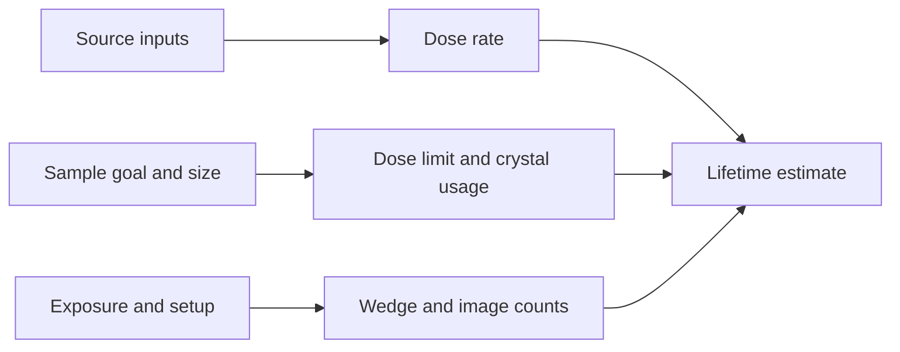

# Quick Start

- [Back to launcher overview](index.qmd)
- [See screenshot and diagram ideas](screenshots.qmd#xtallife)
- Open the calculator with `qp2/bin/xtallife`.
- Review the default beam, wavelength, crystal, and dose-limit values before trusting the result.
- Choose an `experiment goal` preset first, because it can automatically change dose-limit and anomalous settings.
- Adjust source, sample, and experimental setup parameters.
- Watch the computed dose rate, rotisserie factor, maximum images, and wedge size update as you edit values.

# Overview

`xtallife` is a GUI calculator for expected crystal lifetime and damage-limited image count.

Launcher target:

- `qp2/bin/xtallife` -> `python -m qp2.radiation_decay.xtallife`

Window title:

- `Holton's Expected Crystal Lifetime Calculator`

Use this tool when:

- you want a lightweight lifetime calculator instead of the more optimization-heavy `dose_planner`
- you want to estimate dose rate, lifetime, and images-per-wedge from beam and sample geometry
- you want experiment-goal presets such as cryo, room temperature, MAD/SAD, or S-SAD

# Main Layout

The window is organized into three large grouped sections.

## `Xray Source Parameters`

Main inputs and outputs include:

- `full flux`
- `attenuation factor`
- `transmittance`
- horizontal and vertical beam size
- `wavelength`
- `k_dose`
- `dose rate`

Use this section for:

- entering beamline source conditions
- checking the calculated dose-rate consequences of your flux, transmission, and wavelength choices

## `Sample Parameters`

Main controls include:

- `experiment goal`
- resolution
- dose limit
- crystal dimensions
- anomalous-related controls when relevant

Use this section for:

- selecting the scientific goal of the experiment
- defining crystal size and damage tolerance
- letting the goal preset drive dose-limit behavior when appropriate

## `Experimental Setup`

Main controls include:

- exposure time
- inverse beam
- number of wavelengths
- translation and wedge-style behavior
- warning handling

Use this section for:

- estimating how collection strategy affects usable images
- checking wedge size and crystal utilization

# Experiment Goal Presets

The `experiment goal` combo is one of the most important controls.

Examples include:

- `high resolution (cryo)`
- `MAD/SAD phasing`
- `S-SAD phasing`
- `room temperature`
- `Se-Met`
- `Hg-Cys`
- `Cys-Cys`
- `Br-RNA`
- `Cl-ligand`
- `photosystem II`
- `putidaredoxin`
- `bacteriorhodopsin`
- `Fe in myoglobin`
- `Custom ...`

What to expect:

- changing the preset can automatically modify dose-limit behavior
- anomalous-focused presets can enable different defaults such as inverse beam or related settings
- room-temperature style presets can force a much smaller allowable dose than cryogenic presets

# Common Workflows

## Fast cryo lifetime estimate

1. Open `xtallife`.
2. Leave `experiment goal` at `high resolution (cryo)` or choose an equivalent preset.
3. Confirm flux, attenuation, wavelength, and beam size.
4. Enter crystal dimensions and exposure time.
5. Review dose rate, max images, and wedge size.

## MAD or SAD planning pass

1. Open `xtallife`.
2. Choose `MAD/SAD phasing` or another anomalous preset.
3. Review the dose limit after the preset change.
4. Adjust exposure, inverse beam, and number of wavelengths.
5. Review the new maximum-image and wedge estimates.

## Room-temperature check

1. Open `xtallife`.
2. Choose `room temperature`.
3. Review the much lower dose tolerance.
4. Adjust exposure and geometry until the image count looks realistic.

# Computed Outputs

Important calculated values include:

- `k_dose`
- `dose rate`
- `rotisserie factor`
- maximum number of images at the dose limit
- images per wedge

Practical note:

- these values update from the current form state, so the calculator is most useful as an interactive what-if tool

# Diagram

# Suggested Screenshots

Best screenshot candidates for this page:

- the full main window showing the three grouped sections
- the `experiment goal` dropdown expanded so users can see the preset list

If you add just one image, the full-window screenshot is the most useful.

# Practical Notes

- default values are pre-populated at startup, so always review them before using the result operationally
- `k_dose` is derived from wavelength
- some presets automatically adjust the dose limit
- if warnings are enabled, QP2 can warn that the wedge size is too small and may automatically adjust exposure time

# Caveats

- `xtallife` is a GUI tool and requires a GUI-capable environment.
- It is an interactive calculator, not a batch-processing or export pipeline.
- Preset changes can overwrite dose-limit assumptions unexpectedly if you are not watching the form.
- Some user actions can trigger automatic behavior changes, including exposure-time adjustment after warnings.

# Related Pages

- [Launcher overview](index.qmd)
- [Dose Planner](dose_planner.qmd)
- [Strategy](strategy.qmd)
